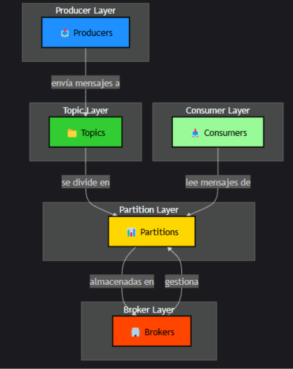

# Proyecto de Streaming con Spark y Kafka

## Descripción del Proyecto
Este proyecto implementa una aplicación de streaming en tiempo real que consume datos sobre vuelos desde un tópico de Kafka y los procesa utilizando Apache Spark. La aplicación está diseñada para demostrar el manejo y procesamiento de flujos de datos en tiempo real, abordando problemas de latencia y volumen de datos.

## Flujo de Trabajo


1. Los datos se envían a un tópico en Kafka.
2. Spark Streaming se conecta al tópico y consume los datos.
3. Los mensajes se procesan y se imprimen en la consola.

## Instalación de Dependencias
Se instaló `pyspark` en un entorno virtual para evitar conflictos de permisos y dependencias con el sistema:

```bash
python3 -m venv myenv
source myenv/bin/activate
pip install pyspark
```

## Archivo de Streaming
Se creó un archivo llamado `streaming_vuelos.py` con el siguiente contenido:

```python
from pyspark import SparkContext
from pyspark.streaming import StreamingContext
from pyspark.streaming.kafka import KafkaUtils

# Crear un contexto de Spark
sc = SparkContext("local[*]", "KafkaStreamingApp")
ssc = StreamingContext(sc, 5)  # Cada 5 segundos

# Conectar a Kafka
kafkaStream = KafkaUtils.createStream(ssc, 'localhost:2181', 'spark-streaming', {'vuelos': 1})

# Procesar los datos
def process_message(message):
    print("Mensaje recibido:", message)

# Para cada RDD en el stream, procesar los mensajes
kafkaStream.foreachRDD(lambda rdd: rdd.foreach(process_message))

# Iniciar el contexto
ssc.start()
ssc.awaitTermination()
```

## Ejecución del Script
Para ejecutar el script, usa el siguiente comando:

```bash
spark-submit /root/streaming_vuelos.py
```

### Resultados Esperados
Al ejecutar el script, la aplicación debería recibir mensajes del tópico `vuelos` en Kafka e imprimirlos en la consola en tiempo real.

### Ejemplo de Mensajes
Supongamos que se envían los siguientes mensajes a Kafka:

```
Vuelo 101: Bogotá a Medellín
Vuelo 102: Medellín a Cali
```

La salida en la consola debería ser:

```
Mensaje recibido: Vuelo 101: Bogotá a Medellín
Mensaje recibido: Vuelo 102: Medellín a Cali
```

## Comprobación de Kafka
Para verificar los tópicos disponibles en Kafka, usa el siguiente comando:

```bash
bin/kafka-topics.sh --list --bootstrap-server localhost:9092
```

## Inicio de Zookeeper y Kafka
Asegúrate de iniciar Zookeeper y Kafka desde el directorio correcto. Los comandos son:

```bash
bin/zookeeper-server-start.sh config/zookeeper.properties
bin/kafka-server-start.sh config/server.properties
```
